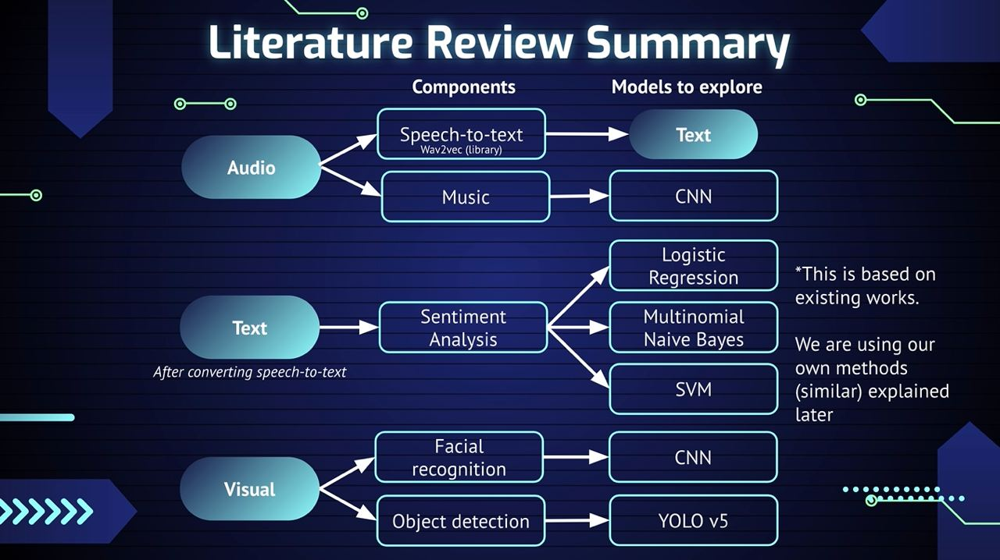

# Video-Sentiment-Analysis

## What the project is about?

## How to run the project
1. Create your python virtual environment - (Optional)
2.  Run Command `` pip install -r requirements.txt `` (Do note that it might take awhile as there are a lot of dependencies)
3. go into the directory ``integrated/webapp/``
4. Run Command ``python app.py``
5. Open your browser and go to http://localhost:5000/

## Important to note 
Some External modules/api require API token to access their services, they may have expired. List of modules that require API token are as follows:
- https://docs.audd.io/#api-methods - get music attributes (title & artist, etc)

- require env file to use spotify API (We included it in our files already for faster access)
CLIENT_ID=""
CLIENT_SECRET="""
